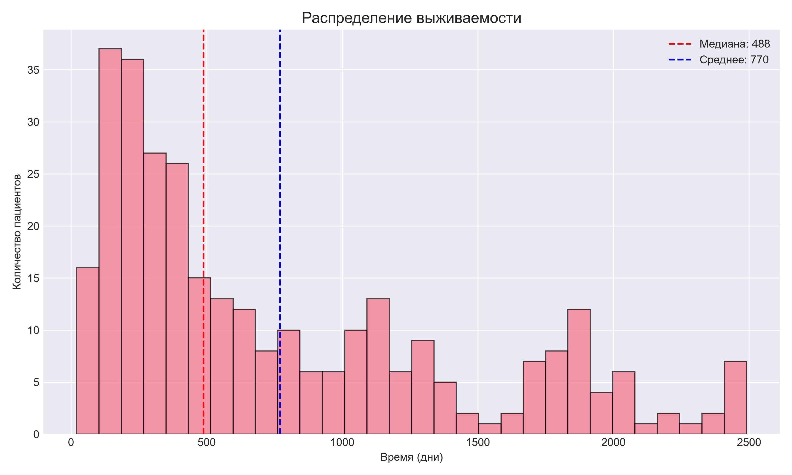
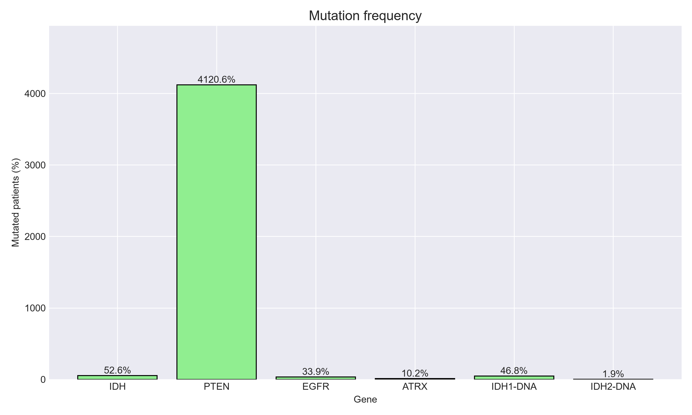
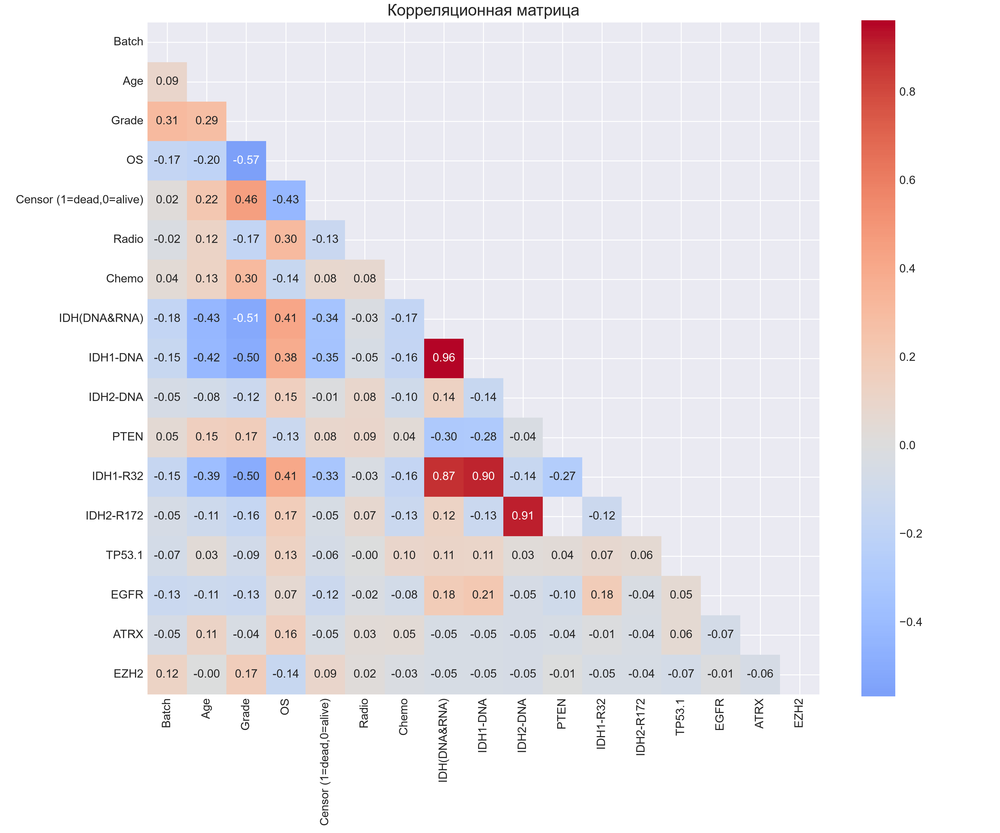

# Анализ клинических данных пациентов с глиомами

[**English version**](README.md) | **Русская версия**

Сквозной проект по анализу данных и машинному обучению, focused on glioma and glioblastoma patient data from the Chinese Glioma Genome Atlas (CGGA) database.

Проект объединяет обработку данных на Python, исследовательский анализ, анализ выживаемости, регрессию Кокса и интерактивные дашборды Yandex DataLens для анализа исходов, генетических мутаций и прогностических факторов у пациентов с раком мозга.

---

## Обзор проекта

Этот проект анализирует клинические и геномные данные пациентов с раком мозга с трех точек зрения:

- **Анализ клинических данных** — демография пациентов, гистология опухоли, степень злокачественности по ВОЗ и история лечения (лучевая и химиотерапия).

- **Анализ выживаемости** — распределение общей выживаемости (OS), кривые выживаемости и сравнение групп по статусу IDH, степени злокачественности и молекулярным подтипам.

- **Анализ прогностических факторов** — регрессионный анализ Кокса для выявления ключевых факторов риска, влияющих на выживаемость, включая статус мутации IDH, степень злокачественности, возраст, пол и генетические маркеры (TP53, PTEN, EGFR, ATRX, EZH2).

- **Анализ генетических мутаций** — анализ частоты мутаций ключевых генов, ассоциированных с глиомами (IDH1, IDH2, TP53, PTEN, EGFR, ATRX, EZH2), и их связь с исходами пациентов.

- **Дашборд Yandex DataLens** — интерактивная бизнес-панель для исследования ключевых клинических показателей, метрик выживаемости и паттернов мутаций.

Цель этого проекта — продемонстрировать полный аналитический процесс: от исходных данных до очищенных наборов данных, статистических моделей и финального дашборда, подходящего для портфолио.

---

## Инструменты и технологии

| Категория | Инструменты |
|-----------|-------------|
| **Обработка данных** | Python, Pandas, NumPy |
| **Статистический анализ** | SciPy, Lifelines (Cox-регрессия) |
| **Визуализация** | Matplotlib, Seaborn |
| **Машинное обучение** | Scikit-learn |
| **Дашборд** | Yandex DataLens |
| **Контроль версий** | Git, GitHub |

---

## Превью дашборда

### Выживаемость по возрастным группам


### Распределение по молекулярным подтипам


### Анализ мутаций


### Влияние лечения


---

## Превью графиков

### Распределение выживаемости



### Частота мутаций



### Корреляционная матрица



---

## Набор данных

Проект использует клинические и геномные данные из базы **Китайского атласа генома глиом (CGGA)**.

**Источник:** Набор данных CGGA mRNAseq 325  
[https://www.cgga.org.cn/](https://www.cgga.org.cn/)

Исходные файлы данных не включены в этот репозиторий, так как они хранятся в папке `data/`, которая исключена из отслеживания Git.

### Основной исходный файл:

- `CCGA_clinical_mRNAseq325.csv`

### Описание набора данных:

- **Пациенты:** 325 пациентов с глиомой
- **Признаки:** 24 клинические и геномные переменные
- **Основные переменные:**
  - Демография: возраст, пол
  - Клинические: степень злокачественности по ВОЗ, гистология, подтип TCGA
  - Лечение: лучевая терапия, химиотерапия
  - Исходы: общая выживаемость (OS), статус цензурирования
  - Генетика: мутации IDH1/IDH2, TP53, PTEN, EGFR, ATRX, EZH2

---

## Структура проекта

```
Brain/
├── data/
│   ├── processed/
│   │   └── brain_cancer_clean.csv
│   └── datalens/
│       ├── patient_listings.csv
│       ├── survival_by_grade.csv
│       └── ...
├── results/
│   ├── figures/
│   │   ├── age_distribution.png
│   │   └── ...
│   └── tables/
│       ├── dataset_overview.csv
│       └── ...
├── scripts/
│   ├── config.py
│   ├── main.py
│   ├── 01_check_data.py
│   ├── 02_basic_eda.py
│   └── ...
├── screenshots/
│   └── ...
├── requirements.txt
├── README.md
├── README_RU.md
└── .gitignore
```
